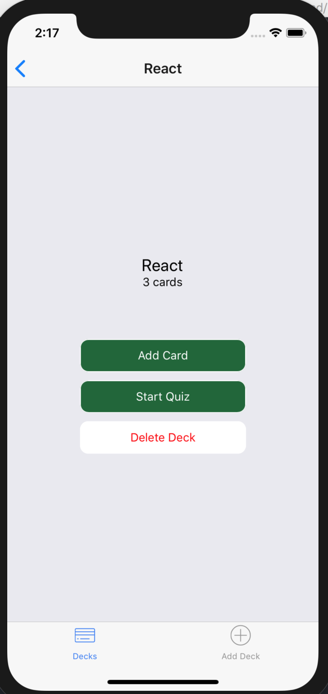

# Mobile Flashcards App

Written in [React Native Framework](https://facebook.github.io/react-native/), this is an iOS mobile application that allows users to study collections of cards. In the app, a user can create a new deck, which collects a specific type of cards. In each deck, a user can then add flashcards to it and take a quiz on that deck.

## How to install

run `npm install`

## How to run

run `npm start` and then either open iPhone simulator on laptop or physical iPhone device with [Expo](https://expo.io/).  
